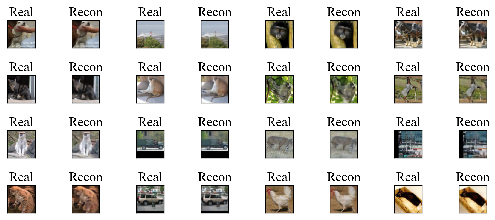
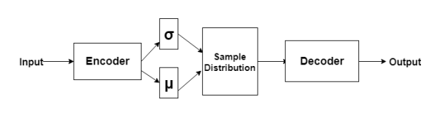
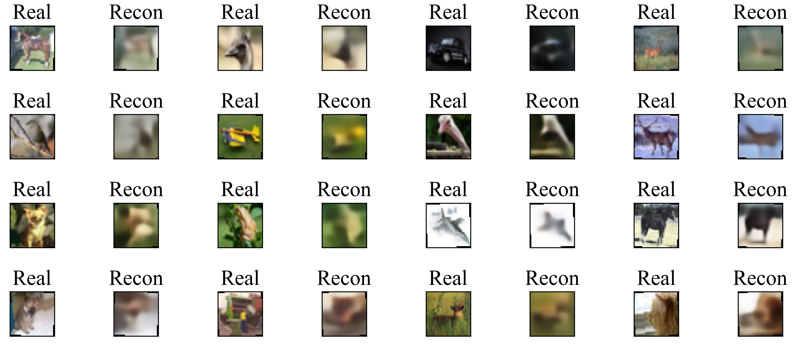
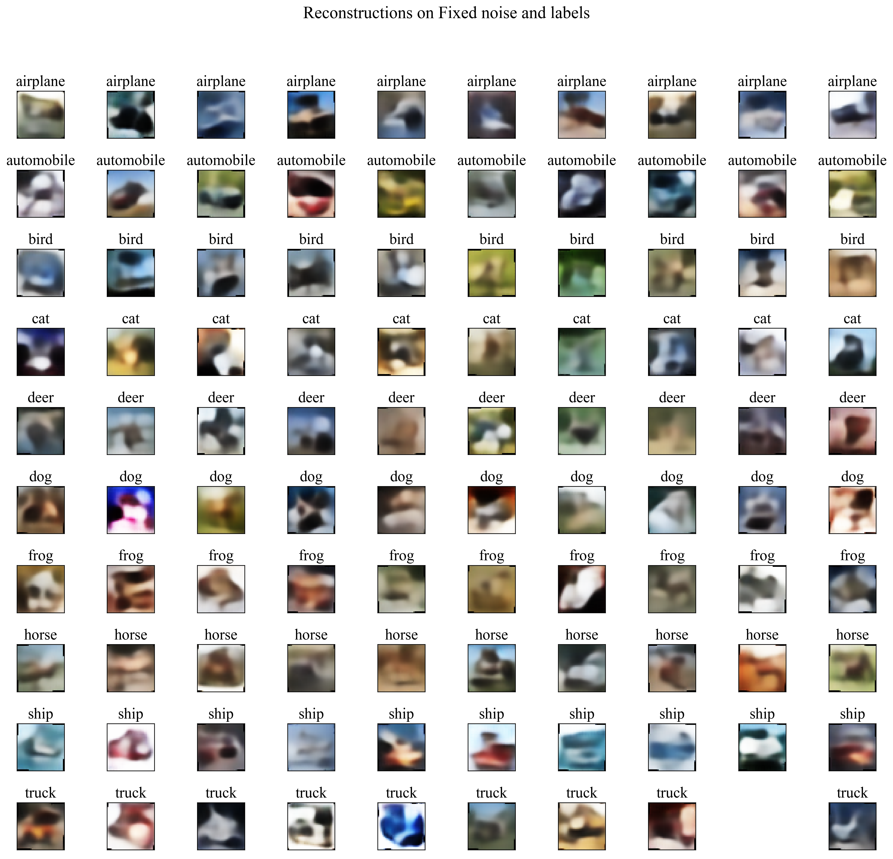

# My Experiments with Convolutional and Variational Autoencoders.

  

## What are autoencoders?
- To put in simple terms, Autoencoders are simply feature extractors with additional task of\
 reconstructiong the given input which maybe images or videos with minimum losses.
- In Modern neural networks the autoencoders are utilized for many other purposes like that of \
 image segmentation (refer U-nets), image denoising, image completion or also in modern reinforcement learning algorithms (Graph neural networks).
 
## Here is my experience of trying to use convolutional autoencoders.
- Convolutional Autoencoders work well untill scaled down to 1x1 feature levels.
- One can not be hopeful of generating a new image using only the trained conv-generator.
- Making the autoencoder conditional does not help to improve the quality of images reproduced.
 

This is my best attempt at reproducing the images using a conv-autoencoder for code size of 2x2 features.
Dataset         - STL10
Loss Criterion  - MSE Loss(0.0028)
Network Type    - Simple Convolutional Network

  

 

## What are Variational Autoencoders.
- Variational Autoencoders are a link between the autoencoders and generative networks. Simply, they are \
 also able to sample and create new images better than conv-autoencoders.
- It has a additional KL-Divergence loss which aims to remove inter-dependibility of each feature of the 
 bottleneck part and spread it in a lower bound known to resample it.

  

## Here is my experience of trying to use variational autoencoders.
- Here I wanted to use only 40 features so Image reconstructions are not very clear but should be better with \
 more features on last part of encoder
- I have also made only the decoder part of network conditional by supplying additional labels. (previous experiments \
 of making the whole network conditional also gives same results).
 
Dataset         - Cifar10
Loss Criterion  - Kl+MSE loss (~13000) 
Feature size    - 40
Network Type    - VAE
 

  

 

### Samples reproduced only using the trained generator

  

I know it is not the best but it created this only using 40 features and also for a complex dataset then MNIST. 

### TO Do (Future work)
- Image completion.
- Denoising images.